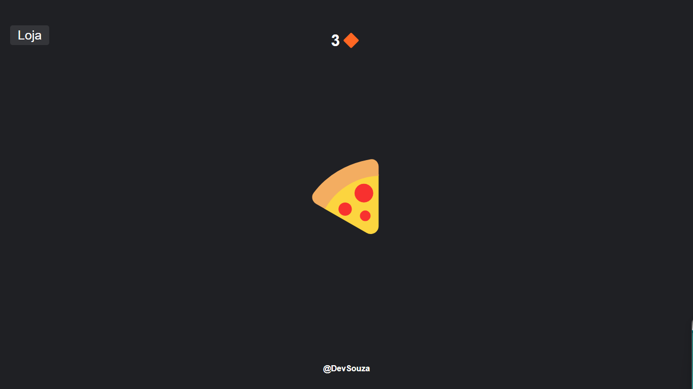

# Clicker Game 🍔

Bem-vindo ao **Clicker Game**! Este é um jogo simples e divertido de clicar, onde o objetivo é acumular pontos clicando em alimentos, comprar novos itens e aumentar seu multiplicador de pontos. 

## Funcionalidades

- **Clique** no hambúrguer (🍔) para ganhar pontos.
- **Loja** para comprar novos itens como pizza (🍕), bolo (🍰), torta (🥧) e taco (🌮).
- Cada item comprado aumenta seu multiplicador de pontos.
- Sons para melhorar a experiência de jogo.
  
## Como Jogar

1. Clique no **hambúrguer** para acumular pontos.
2. Use os pontos para comprar **itens** na loja e aumentar seu multiplicador de pontos.
3. Cada item comprado oferece um **multiplicador** de pontos, o que permite acumular mais pontos com cada clique.

## Tecnologias Utilizadas

- **HTML** para a estrutura do jogo.
- **CSS** para o design e animações.
- **JavaScript** para a lógica do jogo e interações.

## Acessar On-line

>[DevSouza-Clicker](https://DevSouza-Clicker.vercel.app)

## Como Rodar Localmente

- Clone o repositório:

   ```bash
   git clone https://github.com/seu-usuario/Clicker.git

## Demonstração
- Aqui está um print do jogo:



## Autor
- Desenvolvido por @DevSouza
